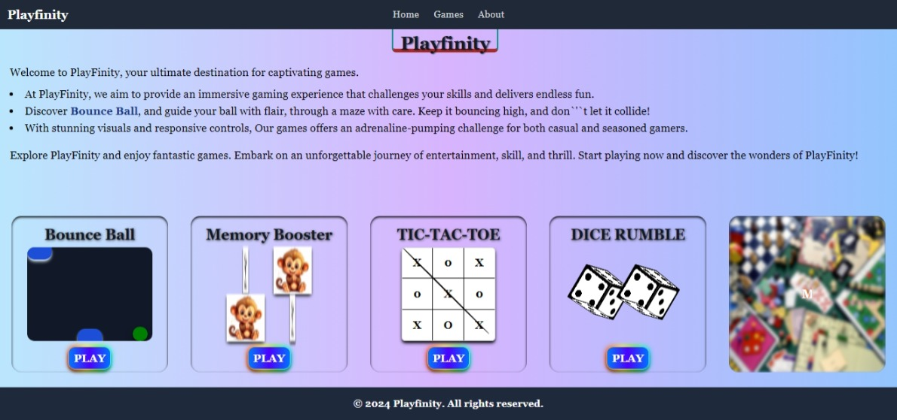
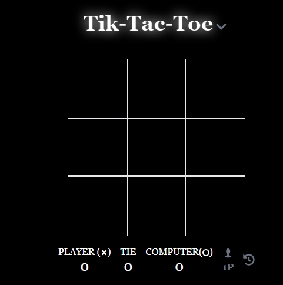

# Play-Finity

A collection of interactive games built using React, Tailwind CSS, JavaScript, HTML, and CSS. This project includes various fun games such as Bounce Ball, Dice Rumble, Memory Booster, and TicTacToe.

## Table of Contents

- [Features](#features)
- [Technologies Used](#technologies-used)
- [Installation](#installation)
- [Usage](#usage)
- [Games](#games)
  - [Bounce Ball](#bounce-ball)
  - [Dice Rumble](#dice-rumble)
  - [Memory Booster](#memory-booster)
  - [TicTacToe](#tictactoe)

## Features

- Interactive and engaging games.
- Responsive design using Tailwind CSS.
- Modern front-end technologies.

## Demo

Check out the live demo: [Play-Finity Live Demo](https://nishant100101.github.io/PlayFinity/)





## Technologies Used

- **HTML**: Standard markup language.
- **CSS**: Styling language.
- **Tailwind CSS**: Utility-first CSS framework.
- **JavaScript**: Core programming language.
- **React**: JavaScript library for building user interfaces.
- **Three.js**: For Dice animation, JS library that allows to create and render 3D graphics.

## Installation

1. Clone the repository:
   ```bash
   git clone https://github.com/yourusername/game-collection.git
   ```
2. Navigate to the project directory:
   ```bash
   cd game-collection
   ```
3. Install dependencies:
   ```bash
   npm install
   ```

## Usage

1. Start the development server:
   ```bash
   npm run dev
   ```
2. Open your browser and navigate to:
   ```
   http://localhost:3000
   ```

## Games

### Bounce Ball

- **Description**: Control a ball to avoid obstacles and score points.
- **How to Play**: Use arrow keys to navigate the ball.

### Dice Rumble

- **Description**: Roll the dice and try to get the highest score.
- **How to Play**: Click on the "Roll Dice" button to play.

### Memory Booster

- **Description**: Flip cards and match pairs to boost your memory.
- **How to Play**: Click on cards to reveal and match pairs.

### TicTacToe

- **Description**: Classic TicTacToe game for two players.
- **How to Play**: Click on the grid to place your mark (X or O).
